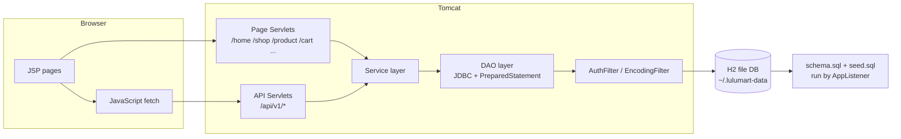

# Architecture

## Layers

1. **Controllers** — thin servlets. Page servlets forward to JSP views with request attributes; API servlets parse/publish JSON via `WebUtil`.
2. **Services** — business rules and validation (roles, ownership, stock, review eligibility, transactions).
3. **DAOs** — JDBC with `PreparedStatement`; `OrderDao.placeOrder` runs the checkout transaction (insert order + items, decrement stock, clear cart, rollback on failure).
4. **Database** — H2 in file mode at runtime, seeded idempotently by `DatabaseSeeder` via the `AppListener`.
5. **Filters** — `EncodingFilter` (UTF-8) and `AuthFilter` (role-based gating) declared in `web.xml`.

## Security model

- Session holds the `User` object under `authUser`.
- `AuthFilter` buckets: BUYER → `/cart /checkout /orders /profile /wishlist` and `cart|wishlist|reviews` APIs; SELLER → `/seller/*`; ADMIN → `/admin/*`; any authenticated user → `/order` & orders API. Unauthenticated API calls return JSON 401.
- Services re-verify permissions (e.g. `ProductService.requireOwned`, `ReviewService.eligibleOrderItemIds`).