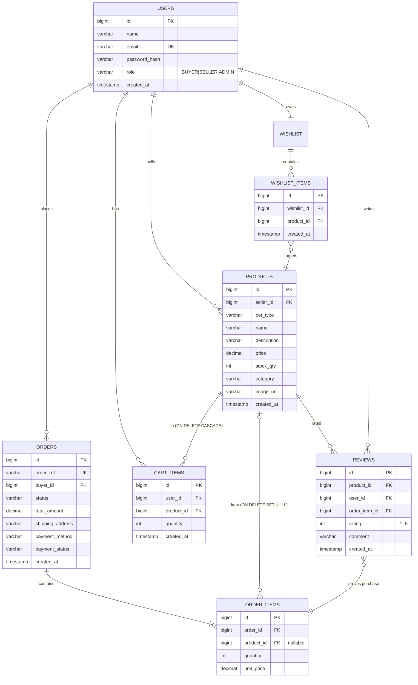

# ER Diagram

Key constraints:
- `order_items.product_id` is nullable and `ON DELETE SET NULL` so deleting a product never erases order history.
- `cart_items.product_id` and `wishlist_items.product_id` are `ON DELETE CASCADE`.
- `reviews` carry a unique `(user_id, product_id, order_item_id)` so each purchased line can be reviewed at most once.