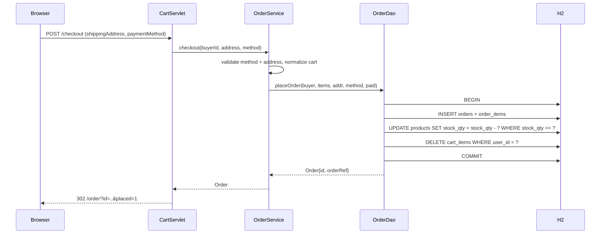
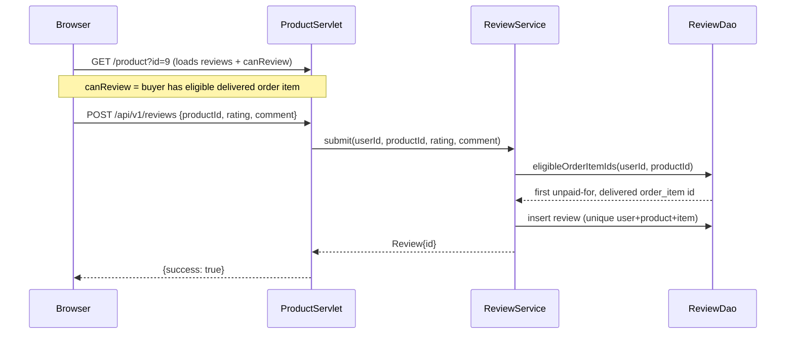
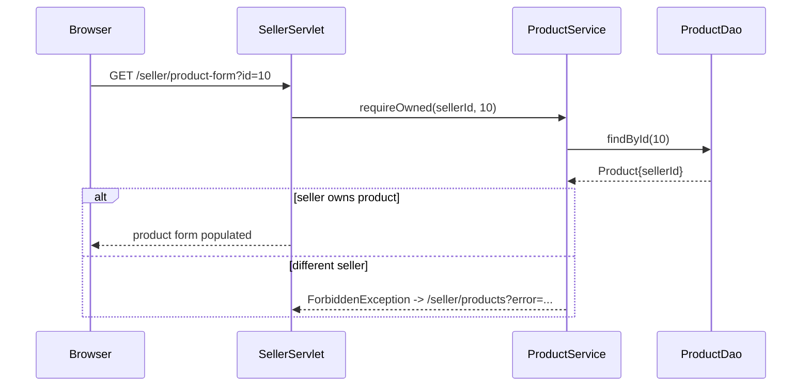

# Sequence Diagrams

## 1. Buyer checkout

```mermaid
sequenceDiagram
    participant B as Browser
    participant CS as CartServlet
    participant SV as OrderService
    participant DAO as OrderDao
    participant DB as H2

    B->>CS: POST /checkout (shippingAddress, paymentMethod)
    CS->>SV: checkout(buyerId, address, method)
    SV->>SV: validate method + address, normalize cart
    SV->>DAO: placeOrder(buyer, items, addr, method, paid)
    DAO->>DB: BEGIN
    DAO->>DB: INSERT orders + order_items
    DAO->>DB: UPDATE products SET stock_qty = stock_qty - ? WHERE stock_qty >= ?
    DAO->>DB: DELETE cart_items WHERE user_id = ?
    DAO->>DB: COMMIT
    DAO-->>SV: Order{id, orderRef}
    SV-->>CS: Order
    CS-->>B: 302 /order?id=..&placed=1
```

## 2. Review after delivery

```mermaid
sequenceDiagram
    participant B as Browser
    participant PS as ProductServlet
    participant RS as ReviewService
    participant RD as ReviewDao

    B->>PS: GET /product?id=9 (loads reviews + canReview)
    Note over B,PS: canReview = buyer has eligible delivered order item
    B->>PS: POST /api/v1/reviews {productId, rating, comment}
    PS->>RS: submit(userId, productId, rating, comment)
    RS->>RD: eligibleOrderItemIds(userId, productId)
    RD-->>RS: first unpaid-for, delivered order_item id
    RS->>RD: insert review (unique user+product+item)
    RS-->>PS: Review{id}
    PS-->>B: {success: true}
```

## 3. Seller edits a product

```mermaid
sequenceDiagram
    participant B as Browser
    participant SS as SellerServlet
    participant PS as ProductService
    participant PD as ProductDao

    B->>SS: GET /seller/product-form?id=10
    SS->>PS: requireOwned(sellerId, 10)
    PS->>PD: findById(10)
    PD-->>PS: Product{sellerId}
    alt seller owns product
        SS-->>B: product form populated
    else different seller
        PS-->>SS: ForbiddenException -> /seller/products?error=...
    end
```