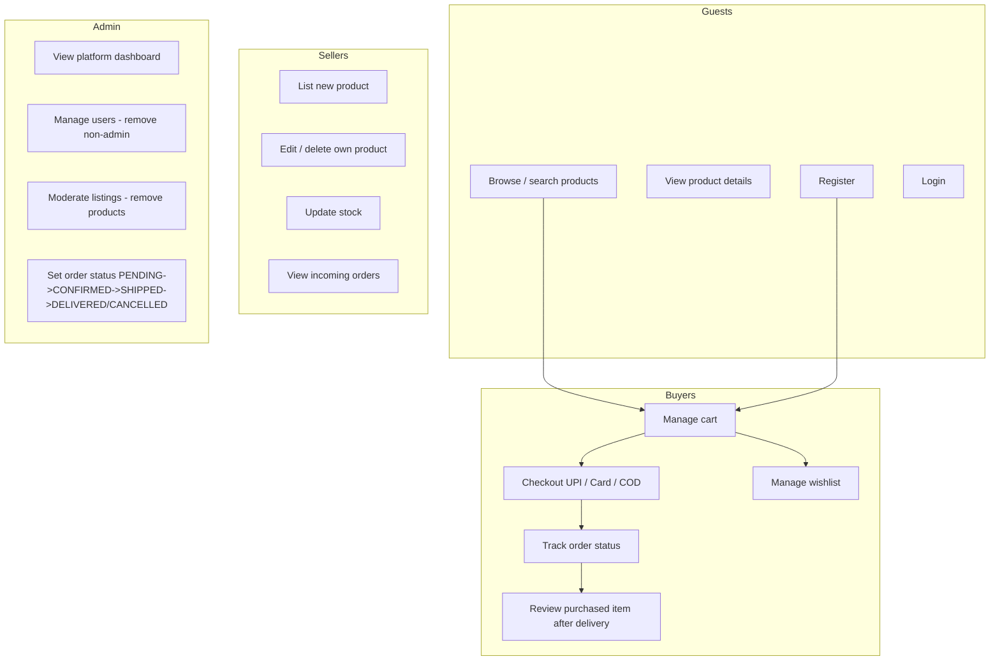

# Use Cases

## Key business rules
- Only authenticated **buyers** can cart, checkout, wishlist, or review.
- A buyer may review a product **only via a delivered (SHIPPED/DELIVERED) order item they haven't reviewed yet**.
- Sellers may only create/edit/delete/restock **their own** products.
- Admin users are protected from deletion; only non-admin accounts can be removed.
- Cart quantity cannot exceed available stock; checkout decreases stock atomically and clears the cart.